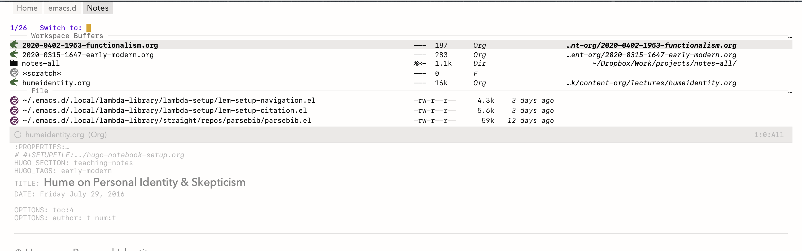
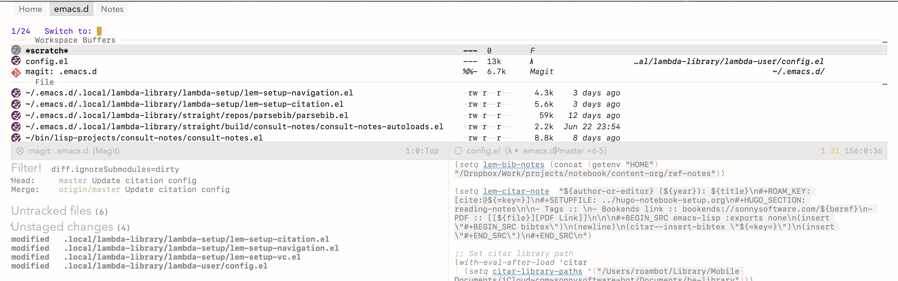

#+title: Tabspaces
#+author: Colin McLear
#+language: en
#+export_file_name: tabspaces.texi
#+texinfo_filename: tabspaces.info
#+texinfo_dir_category: Emacs
#+texinfo_dir_title: Tabspaces: (tabspaces).
#+texinfo_dir_desc: Tabbed workspaces using tab-bar and project.el

#+html: 
#+html: 
#+html: 

Tabspaces leverages [[https://github.com/emacs-mirror/emacs/blob/master/lisp/tab-bar.el][tab-bar.el]] and [[https://github.com/emacs-mirror/emacs/blob/master/lisp/progmodes/project.el][project.el]] (both built into emacs 27+) to
create buffer-isolated workspaces (or "tabspaces") that also integrate with your
version-controlled projects. It should work with emacs 27+. It is tested to work
with a single frame workflow, but should work with multiple frames as well.

While other great packages exist for managing workspaces, such as [[https://github.com/alphapapa/bufler.el][bufler]],
[[https://github.com/nex3/perspective-el][perspective]] and [[https://github.com/Bad-ptr/persp-mode.el][persp-mode]], this package is less complex than those alternatives, and works
entirely based on the built-in (to emacs 27+) tab-bar and project packages. If
you like simple, this may be the workspace package for you. That said, bufler,
perspective or persp-mode, etc. may better fit your needs.

*NOTE*: version 1.2 renames several functions and streamlines tab and project
creation. Apologies if this breaks your workflow. Please update your configuration accordingly.

** Basic Usage

Calling the minor-mode =tabspaces-mode= sets up newly created tabs as
buffer-isolated workspaces using =tab.el= in the background. Calling
=tabspaces-mode= does not itself create a new tabbed workspace.

Switch or create workspace via =tabspaces-switch-or-create-workspace=. Close a
workspace by invoking =tabspaces-close-workspace=. Note that these two functions
are simply wrappers around native =tab-bar= commands. You can close a workspace
and /kill/ all buffers associated with it using
=tabspaces-kill-buffers-close-workspace=.

Open an existing version-controlled project in its own workspace using
=tabspaces-open-or-create-project-and-workspace=. If no such project exists it
will then create one in its own workspace for you.

See workspace buffers using =tabspaces-switch-to-buffer= (for =consult= integration see
below), which will only show buffers in the workspace (but list-buffers,
ibuffer, etc. will show all buffers). Setting
=tabspaces-use-filtered-buffers-as-default= to =t= remaps =switch-to-buffer= to
=tabspaces-switch-to-buffer=.

Adding buffers to a workspace is as simple as opening the buffer in
the workspace. Delete buffers from a workspace either by killing them or using
one of either =tabspaces-remove-selected-buffer= or
=tabspaces-remove-current-buffer=. Removed buffers are still available from the
default tabspace unless the variable =tabspaces-remove-to-default= is set to =nil=.

*NOTE* that other than tabbed buffer isolation for all created window tabs this
package does not modify =tab-bar=, =tab-line=, or =project= in any way. It simply adds
convenience functions for use with those packages. So it is still up to the user
to configure tabs, etc., however they like.

Here are some screenshots of tabspaces (with my [[https://github.com/Lambda-Emacs/lambda-themes][lambda-themes]]) and using =consult-buffer= (see below for instructions on that setup). You can see the workspace isolated buffers in each and the tabs at top:

#+ATTR_HTML: :width 85%

#+ATTR_HTML: :width 85%

** Installation

You may install this package either from Melpa (=M-x package-install tabspaces
RET=) or by cloning this repo and adding it to your load-path.

** Setup

Here's one possible way of setting up the package using [[https://github.com/jwiegley/use-package][use-package]] (and
[[https://github.com/raxod502/straight.el][straight]], if you use that).

#+begin_src emacs-lisp
(use-package tabspaces
  ;; use this next line only if you also use straight, otherwise ignore it.
  :straight (:type git :host github :repo "mclear-tools/tabspaces")
  :hook (after-init . tabspaces-mode) ;; use this only if you want the minor-mode loaded at startup.
  :commands (tabspaces-switch-or-create-workspace
             tabspaces-open-or-create-project-and-workspace)
  :custom
  (tabspaces-use-filtered-buffers-as-default t)
  (tabspaces-default-tab "Default")
  (tabspaces-remove-to-default t)
  (tabspaces-include-buffers '("*scratch*"))
  (tabspaces-initialize-project-with-todo t)
  (tabspaces-todo-file-name "project-todo.org")
  ;; sessions
  (tabspaces-session t)
  (tabspaces-session-auto-restore t)
  ;; additional options
  (tabspaces-fully-resolve-paths t)  ; Resolve relative project paths to absolute
  (tabspaces-exclude-buffers '("*Messages*" "*Compile-Log*"))  ; Additional buffers to exclude
  (tab-bar-new-tab-choice "*scratch*"))
#+end_src

Note the inclusion of the `tab-bar` setting, which is built-in to Emacs and allows a number of different options for what buffer to set for a newly created tab.

*** Keybindings
Workspace Keybindings are defined in the following variable:

#+begin_src emacs-lisp
(defvar tabspaces-command-map
  (let ((map (make-sparse-keymap)))
    (define-key map (kbd "C") 'tabspaces-clear-buffers)
    (define-key map (kbd "b") 'tabspaces-switch-to-buffer)
    (define-key map (kbd "d") 'tabspaces-close-workspace)
    (define-key map (kbd "k") 'tabspaces-kill-buffers-close-workspace)
    (define-key map (kbd "o") 'tabspaces-open-or-create-project-and-workspace)
    (define-key map (kbd "r") 'tabspaces-remove-current-buffer)
    (define-key map (kbd "R") 'tabspaces-remove-selected-buffer)
    (define-key map (kbd "s") 'tabspaces-switch-or-create-workspace)
    (define-key map (kbd "t") 'tabspaces-switch-buffer-and-tab)
    (define-key map (kbd "w") 'tabspaces-show-workspaces)
    (define-key map (kbd "T") 'tabspaces-toggle-echo-area-display)
    map)
  "Keymap for tabspace/workspace commands after `tabspaces-keymap-prefix'.")
#+end_src

The variable =tabspaces-keymap-prefix= sets a key prefix (default is =C-c TAB=) for
the keymap, but this can be changed to anything the user prefers. Set it to =nil=
to disable automatic keymap binding entirely.

*Note on key conflicts:* If you want to use =C-x TAB= as the prefix, be aware that
in terminal Emacs, =TAB= and =C-i= are indistinguishable. However, in GUI Emacs,
=C-x TAB= and =C-x C-i= are separate keybindings, so you can use =C-x TAB= for
tabspaces while keeping =C-x C-i= for =indent-rigidly=.

*** Buffer Filtering

When =tabspaces-mode= is enabled use =tabspaces-switch-to-buffer= to choose from a
filtered list of only those buffers in the current tab/workspace. Though =nil= by
default, when =tabspaces-use-filtered-buffers-as-default= is set to =t= and
=tabspaces-mode= is enabled, =switch-to-buffer= is globally remapped to
=tabspaces-switch-to-buffer=, and thus only shows those buffers in the current
workspace. For use with =consult-buffer=, see below.

*** Switch Tabs via Buffer

Sometimes the user may wish to switch to some open buffer in a tabspace and switch to that tab as well. Use =(=tabspaces-switch-buffer-and-tab=) to achieve this. If the buffer is open in more than one tabspace the user will be prompted to choose which tab to switch to. If there is no such buffer user will be prompted on whether to create it in a new tabspace or the current one.

*** Tabs & Projects

The =tabspaces-open-or-create-project-and-workspace= function provides a
versatile way to manage projects and their associated workspaces in
Emacs. Here's what you can do with it:

1. *Open Existing Projects*: Open an existing version-controlled project
   in its own workspace. The function will switch to the project's tab
   if it already exists.

2. *Create New Projects*: If no such project exists at the specified
   path, it will create one in its own workspace for you, initializing
   version control (git or other VCS) in the process.

3. *Descriptive Tab Naming*:

    - Tabs are named descriptively based on the project structure.
    - In case of naming conflicts, it intelligently renames tabs to avoid
      confusion.

4. *Multiple Tabs for the Same Project*:

    - By using a universal argument (C-u) before calling the function,
      you can force the creation of a new tab even for already open project tabs.
    - The first tab will have the original project name.
    - Subsequent tabs will be automatically named with incrementing
      numbers (e.g., "ProjectName<2>", "ProjectName<3>").
    - This is useful when you want to work on different aspects of the
      same project in separate workspaces.

*** Persistent Tabspaces

Tabspaces provides basic functionality to save and restore both global (all
tabspaces) and project-specific tabspace sessions. These sessions store:

- Open file-visiting buffers in each tab
- Dired, eshell, and shell buffers (via the built-in handlers; see [[#non-file-buffer-restoration][Non-file
  Buffer Restoration]] below for the hook to add others such as vterm or eat)
- Window configurations (splits, sizes, buffer positions)

**** Configuration

By default, project sessions are stored in their respective project root
directories as hidden files (e.g. =.{project-basename}-tabspaces-session.el=). So for a project at =/home/user/myproject/=, the session file would be =.myproject-tabspaces-session.el=.
You can configure where project sessions are stored using
=tabspaces-session-project-session-store=:

#+begin_src elisp
;; Store in project directories (default)
(setq tabspaces-session-project-session-store 'project)

;; Store all project sessions in a specific directory
(setq tabspaces-session-project-session-store "~/.emacs.d/tabspaces-sessions/")

;; Use a custom function to determine location
(setq tabspaces-session-project-session-store
      (lambda (project-root)
        (expand-file-name
         (concat "sessions/" (file-name-nondirectory project-root) "-tabspaces-session.el")
         project-root)))
#+end_src

The /global/ session file location is controlled by
=tabspaces-session-file= (defaults to =~/.emacs.d/tabsession.el=).

**** Usage
:PROPERTIES:
:CUSTOM_ID: usage
:END:
***** Global Sessions
:PROPERTIES:
:CUSTOM_ID: global-sessions
:END:
Save all tabs and their configurations:

#+begin_src elisp
M-x tabspaces-save-session
#+end_src

Restore saved global session:

#+begin_src elisp
M-x tabspaces-restore-session
#+end_src

***** Project Sessions
:PROPERTIES:
:CUSTOM_ID: project-sessions
:END:
Save current project tab and its configuration:

#+begin_src elisp
M-x tabspaces-save-current-project-session
#+end_src

Restore sessions contextually:

#+begin_src elisp
;; When in a project tab (with per-project storage enabled):
M-x tabspaces-restore-session  ; Restores current project's session

;; When in a non-project tab:
M-x tabspaces-restore-session  ; Restores global session

;; Explicitly restore a specific project:
(tabspaces-restore-session "/path/to/project")
#+end_src

***** Automatic Session Handling
:PROPERTIES:
:CUSTOM_ID: automatic-session-handling
:END:
Enable automatic session saving on Emacs exit:

#+begin_src elisp
(setq tabspaces-session t)  ; Save sessions automatically
#+end_src

Control automatic session restoration:

#+begin_src elisp
;; Auto-restore sessions on startup and when opening projects
(setq tabspaces-session-auto-restore t)

;; Disable auto-restore (sessions must be manually restored)
(setq tabspaces-session-auto-restore nil)
#+end_src

When =tabspaces-session-auto-restore= is =t=:
- Global sessions are restored on Emacs startup
- Project sessions are restored when opening projects (if per-project storage is enabled)

When =tabspaces-session-auto-restore= is =nil=:
- No automatic restoration occurs
- Use =M-x tabspaces-restore-session= to manually restore sessions
- The command is context-aware: restores project session when in a project tab, global session otherwise

Session support for saving tabspaces across Emacs sessions has been implemented. Setting =tabspaces-session= to =t= ensures that all open tabspaces and file-visiting buffers are saved. Sessions can be restored interactively via =(tabspaces-restore-session)=, which is context-aware and will restore the current project's session when called from a project tab, or the global session otherwise. Automatic restoration is controlled by =tabspaces-session-auto-restore=: when set to =t=, sessions are restored on startup and when opening projects; when =nil=, all restoration is manual. Project sessions can be saved individually via =(tabspaces-save-current-project-session)= and are stored either in project directories or a central location based on =tabspaces-session-project-session-store=.

***** Advanced Session Management

For more granular control over session management, additional functions are available:

#+begin_src elisp
;; Save all project tabs to their individual session files
(tabspaces-save-all-project-sessions)

;; Save only non-project tabs to the global session file
(tabspaces-save-non-project-tabs)
#+end_src

These functions are particularly useful when using per-project session storage mode,
allowing you to selectively save different types of workspaces.

***** Non-file Buffer Restoration
:PROPERTIES:
:CUSTOM_ID: non-file-buffer-restoration
:END:

In addition to file-visiting buffers, tabspaces ships handlers that save and
restore =dired=, =eshell=, and =shell= buffers as part of a session. For
other buffer kinds (=term=, =vterm=, =eat=, =ielm=, etc.) tabspaces exposes a
small registration API; users wire up the kinds they care about in their own
config. The package itself does not depend on any third-party terminal or
REPL package.

The save-side handler captures =default-directory= and the buffer name; the
restore-side handler creates a fresh buffer at the saved directory. Running
processes are *not* revived -- a restored shell starts a new process; a
restored eshell starts a new eshell. Histories and output are not preserved.

****** Registration API

#+begin_src elisp
(tabspaces-register-buffer-kind KIND SAVE-FN RESTORE-FN)
#+end_src

- =KIND= is a symbol used as the =:kind= value in serialized records.
- =SAVE-FN= takes a buffer and returns either a plist of the form
  =(:kind KIND :dir DIR :name NAME ...)= or =nil= to skip the buffer. Add
  any extra keys your restore-fn needs.
- =RESTORE-FN= takes such a plist and returns the buffer it created or
  reused, or =nil= to skip the record.

Re-registering a =KIND= replaces the previous entry. The most recently
registered handler runs first on save; the three built-ins (=dired=,
=eshell=, =shell=) are registered at package load time and act as
fallbacks. Restore-fn bodies must create buffers but must *not* call
window-configuration-changing functions like =pop-to-buffer-other-window=
or =delete-other-windows= -- the outer restore loop wraps each record's
handler in =save-window-excursion= and then calls =window-state-put= to
set the final layout.

****** Example: vterm

#+begin_src elisp
;; In init.el, after (require 'tabspaces).
(tabspaces-register-buffer-kind
 'vterm
 ;; SAVE-FN: only fires for vterm-mode buffers. Safe to define
 ;; before vterm itself is loaded -- derived-mode-p returns nil
 ;; for unloaded modes.
 (lambda (b)
   (with-current-buffer b
     (when (derived-mode-p 'vterm-mode)
       (list :kind 'vterm
             :dir default-directory
             :name (buffer-name)))))
 ;; RESTORE-FN: load vterm lazily, then create the buffer at the saved
 ;; directory. Wrap the body in condition-case so a single bad record
 ;; doesn't poison the rest of the restore.
 (lambda (rec)
   (require 'vterm)
   (let ((name (plist-get rec :name))
         (dir  (plist-get rec :dir)))
     (or (tabspaces--reuse-existing-buffer name)
         (condition-case err
             (let ((default-directory dir))
               (vterm name))
           (error
            (message "tabspaces: vterm restore skipped (%s): %S" dir err)
            nil))))))
#+end_src

TRAMP paths are handled at the dispatch layer (skipped with a summary
message), so handlers do not need their own remote-path checks.

****** Registering after =(require 'tabspaces)=

Register at top level, *not* inside =(with-eval-after-load 'THIRD-PARTY ...)=.
If =tabspaces-session-auto-restore= is =t=, =tabspaces-mode 1= triggers a
restore immediately on startup; if your vterm handler is wrapped in
=(with-eval-after-load 'vterm ...)= the registration has not yet fired
when the restore runs, and any =:kind vterm= records are reported as
unknown kinds (single summary message) and skipped. Calling =M-x vterm=
later loads vterm and runs the registration -- but the records are
already gone from the session.

The canonical pattern shown above puts =(require 'vterm)= inside the
restore-fn body, so the third-party package loads only when a record of
that kind is actually being restored. For users whose package is not
pre-compiled, the first restore pays the one-time package-load cost.

****** Caveats

- *Cross-tab name collisions*: per-tab dedup wins over name preservation.
  If two tabs each saved a buffer named =*eshell*=, restoring the second
  tab's eshell creates a fresh buffer (typically with a =<N>= suffix) so
  workspace isolation is maintained.
- *TRAMP*: remote paths are skipped on restore with a summary message
  ("tabspaces: N remote buffer(s) skipped (TRAMP)") rather than connecting
  synchronously per buffer. Re-open remote buffers manually after restore.
- *Shell semantics*: restored shell-mode buffers are fresh processes at
  the saved =default-directory= -- no command history, no running state.
  Users with named shells like =*shell-prod*= who depend on history should
  know the restored buffer starts empty.
- *Single-frame restore*: =tabspaces-restore-session= drives the current
  frame's tabs. Calling it on a second frame performs a second full
  restore; the dedup check sees the first frame's buffers as foreign and
  creates fresh ones.
- *One-way backward compat*: session files written by this version include
  plist records that older versions cannot read. Downgrading requires
  deleting any saved session files first.

****** More example handlers

#+begin_src elisp
;; term-mode (and ansi-term) -- spawns a PTY at the saved directory.
(tabspaces-register-buffer-kind
 'term
 (lambda (b)
   (with-current-buffer b
     (when (derived-mode-p 'term-mode)
       (list :kind 'term
             :dir default-directory
             :name (buffer-name)))))
 (lambda (rec)
   (let ((name (plist-get rec :name))
         (dir  (plist-get rec :dir)))
     (or (tabspaces--reuse-existing-buffer name)
         (condition-case err
             (let* ((default-directory dir)
                    (program (or explicit-shell-file-name
                                 (getenv "SHELL")
                                 shell-file-name)))
               ;; ansi-term wraps make-term with a user-provided buffer
               ;; name, sidestepping (term)'s hardcoded *terminal* name.
               (ansi-term program (substring name 1 -1)))
           (error
            (message "tabspaces: term restore skipped (%s): %S" dir err)
            nil))))))

;; ielm -- Emacs Lisp REPL.
(tabspaces-register-buffer-kind
 'ielm
 (lambda (b)
   (with-current-buffer b
     (when (derived-mode-p 'inferior-emacs-lisp-mode)
       (list :kind 'ielm
             :dir default-directory
             :name (buffer-name)))))
 (lambda (rec)
   (let ((name (plist-get rec :name))
         (dir  (plist-get rec :dir)))
     (or (tabspaces--reuse-existing-buffer name)
         (condition-case err
             (let ((default-directory dir))
               (ielm name))
           (error
            (message "tabspaces: ielm restore skipped (%s): %S" dir err)
            nil))))))
#+end_src

*** Additional Customization

**** Echo Area Display

Tabspaces can optionally display tabs in the echo area (bottom of the frame) instead of the top tab-bar. This feature provides a less visually prominent way to show workspace information.

#+begin_src emacs-lisp
;; Enable echo area tab display
(setq tabspaces-echo-area-enable t)

;; Customize idle delay (default is 1.0 seconds)
(setq tabspaces-echo-area-idle-delay 5.0)

;; Customize the format function (advanced users)
(setq tabspaces-echo-area-format-function #'my-custom-tab-formatter)

;; Toggle echo area display (bound to C-c TAB T by default)
(tabspaces-toggle-echo-area-display)

;; Troubleshooting functions
(tabspaces-restart-idle-timer)      ; Restart the idle timer if display stops working
(tabspaces-echo-area-timer-status)  ; Check timer status for debugging
#+end_src

When enabled, this feature:
- Hides the visual tab-bar at the top of the frame
- Shows formatted tabs in the echo area after the configured idle time
- Does not displace other messages or minibuffer content
- Filters duplicate messages from the =*Messages*= buffer to reduce clutter
- Maintains compatibility with existing tab-bar formatters and themes
- Respects your existing tab-bar format configuration

The echo area display respects your existing tab formatting configuration and works seamlessly with features like SF Symbols for tab numbering.

You can also display workspaces in the echo area on demand using:
#+begin_src emacs-lisp
;; Show workspaces immediately (bound to C-c TAB w by default)
(tabspaces-show-workspaces)
#+end_src

This command shows all workspaces in the echo area without waiting for idle time or enabling the automatic display feature.

**** Buffer Management Integration

Tabspaces provides a minimal API for integrating with buffer management and completion frameworks. Rather than implementing tool-specific features, the package exposes workspace primitives that work with any completion system or buffer management tool.

*Integration API:*

The following functions form the public integration points:

- =(tabspaces--list-tabspaces)= - Returns list of all workspace names
- =(tabspaces--buffer-list &optional frame tabnum)= - Returns buffers for a workspace
  - With no arguments: buffers in current workspace
  - With =tabnum=: buffers in specific workspace by index
- =(tabspaces--current-tab-name)= - Returns current workspace name
- =(tabspaces--local-buffer-p buffer)= - Predicate testing if buffer belongs to current workspace

These functions use the =--= prefix (typically indicating internal functions) but are autoloaded and form the stable integration API. Below are integration examples for popular frameworks.

***** Consult

If you have [[https://github.com/minad/consult][consult]] installed you can implement the following to have workspace buffers in =consult-buffer=:

#+begin_src emacs-lisp
  ;; Filter Buffers for Consult-Buffer

  (with-eval-after-load 'consult
    ;; hide full buffer list (still available with "b" prefix)
    (plist-put consult-source-buffer :hidden t)
    (plist-put consult-source-buffer :default nil)
    ;; set consult-workspace buffer list
    (defvar consult--source-workspace
      (list :name     "Workspace Buffers"
            :narrow   ?w
            :history  'buffer-name-history
            :category 'buffer
            :state    #'consult--buffer-state
            :default  t
            :items    (lambda () (consult--buffer-query
                             :predicate #'tabspaces--local-buffer-p
                             :sort 'visibility
                             :as #'buffer-name)))

      "Set workspace buffer list for consult-buffer.")
    (add-to-list 'consult-buffer-sources 'consult--source-workspace))
#+end_src

This seamlessly integrates workspace buffers into =consult-buffer=, displaying workspace buffers by default and all buffers when narrowing using "b". Note that you can also see all project related buffers and files just by narrowing with "p" in [[https://github.com/minad/consult#configuration][a default consult setup]].

*NOTE*: We use =plist-put= to modify =consult-source-buffer= directly rather than =consult-customize=. The =consult-customize= macro validates its arguments at expansion time, which can fail depending on load order and byte-compilation state (see [[https://github.com/mclear-tools/tabspaces/issues/76][#76]] and [[https://github.com/minad/consult/issues/345][consult#345]]). Using =plist-put= avoids this issue entirely.

*NOTE*: If you typically toggle between having =tabspaces-mode= active and inactive, you may want to include a hook function to turn off the =consult--source-workspace= and modify the visibility of =consult--source-buffer=:

#+begin_src emacs-lisp
  (defun my--consult-tabspaces ()
    "Deactivate isolated buffers when not using tabspaces."
    (require 'consult)
    (cond (tabspaces-mode
           ;; hide full buffer list (still available with "b")
           (plist-put consult-source-buffer :hidden t)
           (plist-put consult-source-buffer :default nil)
           (add-to-list 'consult-buffer-sources 'consult--source-workspace))
          (t
           ;; reset consult-buffer to show all buffers
           (plist-put consult-source-buffer :hidden nil)
           (plist-put consult-source-buffer :default t)
           (setq consult-buffer-sources (remove #'consult--source-workspace consult-buffer-sources)))))

  (add-hook 'tabspaces-mode-hook #'my--consult-tabspaces)
#+end_src

***** Ivy

If you use ivy you can use this function to limit your buffer search to only those in the tabspace:

#+begin_src emacs-lisp
(defun tabspaces-ivy-switch-buffer (buffer)
  "Display the local buffer BUFFER in the selected window.
This is the frame/tab-local equivilant to `switch-to-buffer'."
  (interactive
   (list
    (let ((blst (mapcar #'buffer-name (tabspaces--buffer-list))))
      (read-buffer
       "Switch to local buffer: " blst nil
       (lambda (b) (member (if (stringp b) b (car b)) blst))))))
  (ivy-switch-buffer buffer))
#+end_src

Alternatively, you may use the following function, which is basically a clone of =ivy-switch-buffer= (and thus uses ivy's own implementation framework), but with an additional predicate that only allows showing buffers from the current tabspace:

#+begin_src emacs-lisp
(defun tabspaces-ivy-switch-buffer ()
  "Switch to another buffer in the current tabspace."
  (interactive)
  (ivy-read "Switch to buffer: " #'internal-complete-buffer
            :predicate (when (tabspaces--current-tab-name)
                         (let ((local-buffers (tabspaces--buffer-list)))
                           (lambda (name-and-buffer)
                             (member (cdr name-and-buffer) local-buffers))))
            :keymap ivy-switch-buffer-map
            :preselect (buffer-name (other-buffer (current-buffer)))
            :action #'ivy--switch-buffer-action
            :matcher #'ivy--switch-buffer-matcher
            :caller 'ivy-switch-buffer))
#+end_src

***** ibuffer

To integrate with ibuffer, use hooks to create workspace-based filter groups:

#+begin_src emacs-lisp
(defun my-tabspaces-ibuffer-group ()
  "Group ibuffer entries by tabspace."
  (setq ibuffer-filter-groups
        (mapcar (lambda (tab)
                  (let ((tab-index (tab-bar--tab-index-by-name tab)))
                    (cons tab
                          `((predicate . (member (buffer-name)
                                                (mapcar #'buffer-name
                                                        (tabspaces--buffer-list nil ,tab-index))))))))
                (tabspaces--list-tabspaces))))

(add-hook 'ibuffer-hook #'my-tabspaces-ibuffer-group)
#+end_src

This automatically organizes ibuffer by workspace whenever you open it. You can customize the grouping logic by modifying the filter predicate.

To jump from an ibuffer entry to the tab containing that buffer, use =tabspaces-ibuffer-switch-buffer-and-tab=. Bind it in ibuffer's keymap:

#+begin_src emacs-lisp
(with-eval-after-load 'ibuffer
  (define-key ibuffer-mode-map (kbd "o") #'tabspaces-ibuffer-switch-buffer-and-tab))
#+end_src

**** Included Buffers

By default the =*scratch*= buffer is included in all workspaces. You can modify
which buffers are included by default by changing the value of
=tabspaces-include-buffers=.

If you want emacs to startup with a set of initial buffers in a workspace
(something I find works well) you could do something like the following:

#+begin_src emacs-lisp
  (defun my--tabspace-setup ()
    "Set up tabspace at startup."
    ;; Add *Messages* and *splash* to Tab \`Home\'
    (tabspaces-mode 1)
    (progn
      (tab-bar-rename-tab "Home")
      (when (get-buffer "*Messages*")
        (set-frame-parameter nil
                             'buffer-list
                             (cons (get-buffer "*Messages*")
                                   (frame-parameter nil 'buffer-list))))
      (when (get-buffer "*splash*")
        (set-frame-parameter nil
                             'buffer-list
                             (cons (get-buffer "*splash*")
                                   (frame-parameter nil 'buffer-list))))))

  (add-hook 'after-init-hook #'my--tabspace-setup)
#+end_src

**** File Per Project

By default Tabspaces will create a =project-todo.org= file at the root of the project
when creating a new workspace using =tabspaces-open-or-create-project-and-workspace=.

Use =tabspaces-todo-file-name= to change the name of that file, or =tabspaces-initialize-project-with-todo=
to disable this feature completely.

** Acknowledgments
Code for this package is derived from, or inspired by, a variety of sources.
These include:

- The original buffer filter function
   + https://www.rousette.org.uk/archives/using-the-tab-bar-in-emacs/
   + https://github.com/wamei/elscreen-separate-buffer-list/issues/8
   + https://github.com/kaz-yos/emacs
- Buffer filtering and removal
   + https://github.com/florommel/bufferlo
- Consult integration
   + https://github.com/minad/consult#multiple-sources
